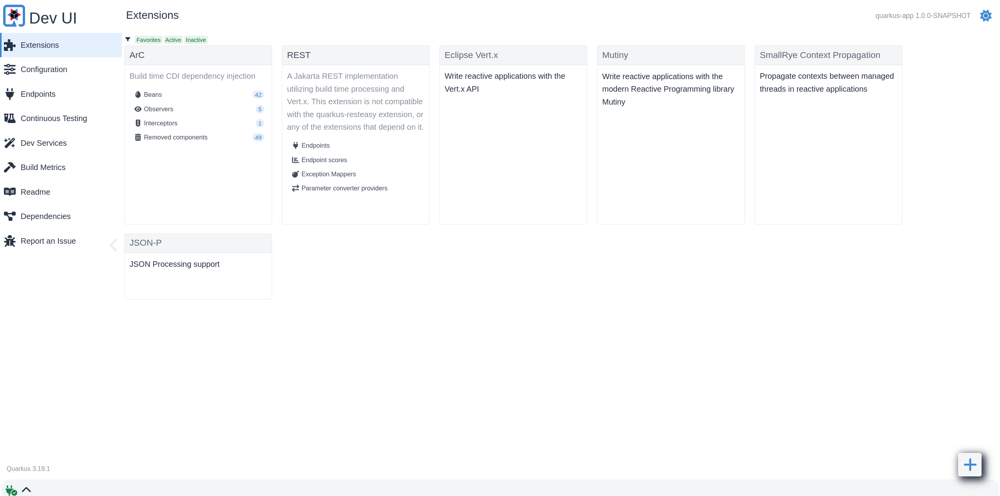
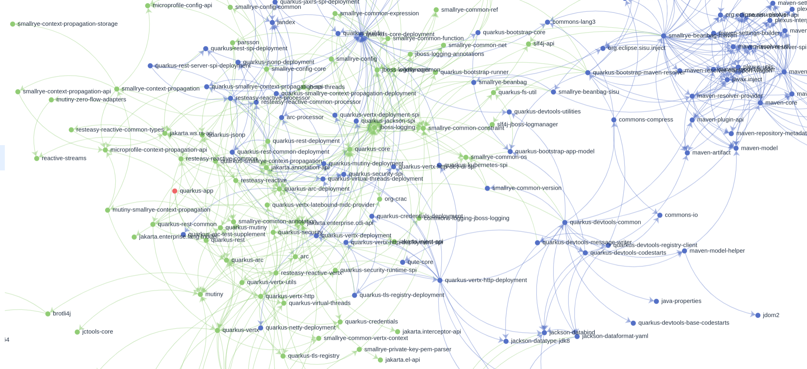
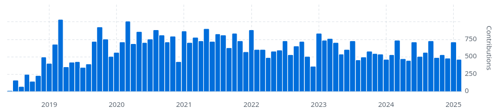

= The role of Quarkus in the modern Java ecosystem

Since its inception in 2019, Quarkus has gradually grown both in user
adoption and innovation. The number of its different research and
development areas is just enormous. It's one of the most active Java
projects you can find right now.

Last year, Quarkus celebrated its 5th birthday and one additional tremendous
milestone -- 1000 contributors! These are contributors of the main
repository only, not considering the additional 170 repositories under the
Quarkiverse organization (which we tackle later in this article).

Quarkus pushes boundaries everywhere you can imagine. So, what does this say
about Quarkus's contribution to the Java ecosystem?

image::./images/1kcontributors.jpg[]

== Quarkus to the moon and beyond

No one would have guessed 6 years ago what could become of Quarkus when a
few very clever minds at Red Hat came together and decided to design a new
Java framework. Undoubtedly, no one would imagine it would revolutionize
traditional Java development and take off so fast. Quarkus brought a new way
of thinking to the engineering workflows -- a framework that not only cares
about the performance but also puts impressive emphasis on the developer
experience.

In my experience, there is no issue proving that Quarkus has something to
offer to any audience. High throughput, lower cloud costs, and
sustainability is easy to justify, especially when we have so many real
users and their applications that validate what Quarkus offers
(https://quarkus.io/userstories/).

However, I'm also an engineer. I love to code and understand the pains of
everyday development tasks. This is why I was blown away the first time I
opened Quarkus's Dev mode. Before that, I was used to either application
server workflow or rebuilding my fat JAR after each change. The Dev mode was
so amazing that all applications I wrote from there (even the application
server tooling) were powered by Quarkus from then on.

But there was one more thing that astonished me: how fast everything moved.
The activity level in Quarkus's GitHub repository was unknown to me before.
Pull requests were reviewed and merged so quickly that your PR would be out
of sync in hours (even minutes from time to time). An automated bot
automatically tagged each issue for the right people to look at. More
importantly, the rate of releases was just amazing. There was a new release
every two weeks and a new feature release every month. Quarkus is keeping
this pace to this day, demonstrating its commitment to both innovation and
the community.

For this article, we can split the main Quarkus features that have an
influence on its position in the Java ecosystem into three categories:

- Performance characteristics and optimizations
- Dev mode and everything it encloses
- Community engagement and support

Feel free to jump to relevant parts if you are already familiar with
Quarkus's basics. However, we need to start from the beginning by providing
the complete picture of where Quarkus stands today.

== What is Quarkus?

If this is the first time you read about Quarkus, I want to start with a
brief overview of this framework and its aims. Java has come a long way
since it was created 30 years ago. Originally designed for long-running
applications that didn't require fast startup times or low memory
utilization, Java struggled when we started moving our workloads to the
cloud. These exact metrics became a prominent influence on our production
costs.

Most of the Java ecosystem wasn't ready for this change, which was one of
the main drivers behind creating Quarkus. Quarkus provides a very modern
approach to application development while it still builds on the shoulders
of giants -- popular and production years-tested technologies like
Hibernate, Netty, or Vert.x. This is why its popularity has skyrocketed
since its announcement. And it is still continuously growing.

More than a JVM framework for enterprise application development, Quarkus
provides a platform for building microservices, serverless, or traditional
monolithic applications, as you'd expect. However, it is by no means limited
to cloud-native applications, and you can also use Quarkus to build any Java
application you can think of: command line (CLI) applications, edge, GitHub
bots, GitHub actions, Kubernetes operators, you name it.

=== Technology packed runtime

Quarkus's website defines Quarkus as "a Kubernetes Native Java stack
tailored for OpenJDK HotSpot and GraalVM, crafted from the best of breed
Java libraries and standards" (https://quarkus.io). If we break it
down:

_Kubernetes native_ means Quarkus makes sure that user experience in
Kubernetes is straightforward. It provides many functionalities that help
with Kubernetes deployments and management. Sometimes, you don't even have
to write any YAML because Quarkus can generate all descriptors for you.

By _tailored for OpenJDK HotSpot and GraalVM_, the definition means that
Quarkus aims to provide a suitable platform for both the traditional JVM
deployments (runnable JAR) and GraalVM (https://www.graalvm.org) native
binaries. The native compilation with GraalVM takes the performance
mechanisms that Quarkus provides to another level. Natively built binaries
start in mere milliseconds and rely on a very low memory. Quarkus guarantees
that you can freely choose between the two as long as you use the
integrations provided by Quarkus (called extensions). A simple flag switch
triggers compilation to native binary with GraalVM. Quarkus integrates all
relevant configurations for the GraalVM so your application compiles
successfully.

_Crafted from the best-of-breed Java libraries and standards_ only says that
the technology stack behind Quarkus is not entirely created from scratch.
Many of the included technologies have been around for some time (e.g.,
Vert.x, Jackson, Hibernate). Quarkus provides a unique way of integrating
them, which we will look into next. But in the end, you use the same
Hibernate as in any other framework, so the learning curve is short.

=== Build time/runtime split

Quarkus is a very performant framework because it splits all application
processing into two phases - build time and runtime. Every framework needs
to execute various tasks when your application starts: loading and parsing
of the configuration, classpath scanning (annotations), analyzing
dependencies, and creating an application model. Traditional frameworks need
to execute all these operations when the application starts. Every time it
starts. So, with every restart, all of this processing needs to be repeated,
even if the application hasn't changed.

Quarkus moves as much framework processing as possible to the build time
(when you compile and package your application). This way, the processing
results are recorded and reused when the application starts. In other words,
they are computed during build time only once and reused at runtime.
image:images/build-time-principle-light.png[]

=== Extensions -- integrating with Quarkus

All the processing described above is further exposed for integrations that
are called extensions. Each extension integrates some library or
functionality so the extension developer can choose which parts of the
library processing can execute during build time or what needs to run at
runtime. For instance, imagine the path on which your OpenAPI document is
exposed. It doesn't change that often, so recording it only once during
build time is sufficient. On the other hand, something like the port on
which our application runs would be unreasonable to fix at build time since
it might run on different ports in different environments, so it needs to be
overridable at runtime.

Additionally, extensions can also provide configuration useful for seamless
GraalVM native builds. The extension developers know the integrated library,
which means they understand what kind of code their library user needs to
write. Providing any of the usually required configurations for GraalVM
build (e.g., reflectively accessed classes) is thus done in the extension
itself, so the users don't need to provide it manually.

There are currently more than 750 extensions available at
https://quarkus.io/extensions/.

=== Quarkiverse

Many library developers see the value that Quarkus can bring to their users
and want to provide an extension for them. Because the number of extensions
grew so quickly that Quarkus's main repository
(https://github.com/quarkusio/quarkus) started to get too big to work with,
we created the Quarkiverse (Quarkus + Universe). Quarkiverse
(https://github.com/quarkiverse) is a GitHub organization that encapsulates
community Quarkus extensions that we couldn't fit into the main repository.
The community contributors maintain individual repositories but are fully
integrated into the Quarkus ecosystem. The repository maintainers can
release their extensions as they need, and Quarkus users can pick them for
their application in precisely the same way as with the core extensions.
Creating a Quarkiverse extension is easy, just follow the
https://github.com/quarkiverse/quarkiverse/wiki#getting-an-extension-onboarded[onboarding
process].

The features described in this section are not all Quarkus and its
extensions can do. One of the best features Quarkus provides is encapsulated
in its development experience called the Dev mode. Each extension can
provide its own "magic" that makes the work with the integrated library
easier or just plainly more fun. Let's look into what we can do in Quarkus
Dev mode next.

== Developer-focused framework

Whether or not any tech is popular is always about the technology. Ask
yourself what is more important to you when choosing your framework. Is it
performance? Or the tooling support? Quarkus bet that it is the overall
development experience. And if you think about it, so many frameworks and
even some programming languages have been created solely to improve the
development experience.

=== Dev mode

While performance characteristics are important, they are primarily relevant
in production environments where we must restrict utilized resources.
However, developers also want technology that helps them be productive and
focused on developing their applications. Technology that understands their
needs and provides a simple way to solve their problems. Quarkus invests
heavily in the developer experience (which pays back).

The single most important productivity tool in Quarkus is its Dev mode. Dev
mode is a continuous run of your Quarkus application in which Quarkus
embraces the REPL (read-eval-print loop) concept. By simply changing our
source code, Quarkus automatically recompiles and reruns our application,
showing the result of our work in mere milliseconds. But it doesn't stop
there.

The Dev mode can start with, for instance, Quarkus CLI
(https://quarkus.io/guides/cli-tooling) like this:

[source,bash]
----
# or ./mvnw quarkus:dev or ./gradlew quarkusDev
$ quarkus dev
...

Listening for transport dt_socket at address: 5005
__  ____  __  _____   ___  __ ____  ______
 --/ __ \/ / / / _ | / _ \/ //_/ / / / __/
 -/ /_/ / /_/ / __ |/ , _/ ,< / /_/ /\ \
--\___\_\____/_/ |_/_/|_/_/|_|\____/___/
2025-02-28 14:33:50,534 INFO  [io.quarkus] (Quarkus Main Thread) quarkus-app 1.0.0-SNAPSHOT on JVM (powered by Quarkus 3.19.1) started in 1.356s. Listening on: http://localhost:8080

2025-02-28 14:33:50,538 INFO  [io.quarkus] (Quarkus Main Thread) Profile dev activated. Live Coding activated.
2025-02-28 14:33:50,538 INFO  [io.quarkus] (Quarkus Main Thread) Installed features: [cdi, rest, smallrye-context-propagation, vertx]

--
Tests paused
Press [e] to edit command line args (currently ''), [r] to resume testing, [o] Toggle test output, [:] for the terminal, [h] for more options>
----

Notice that it automatically opens a debug port for connection if needed.
However, you will find that using the Dev mode's features can often be a
substitute for using the debugger. This command starts an interactive
terminal; the commands are listed at the bottom of the screen. Try pressing
`h` while the Dev mode's terminal is in focus:

[source,bash]
----
The following commands are available:

== Continuous Testing

[r] - Resume testing
[o] - Toggle test output (disabled)

== Exceptions

[x] - Open last exception (or project) in IDE (none)

== HTTP

[w] - Open the application in a browser
[d] - Open the Dev UI in a browser

== System

[s] - Force restart
[e] - Edits the command line parameters and restarts ()
[i] - Toggle instrumentation based reload (disabled)
[l] - Toggle live reload (enabled)
[j] - Toggle log levels (INFO)
[h] - Show this help
[:] - Enter terminal mode
[q] - Quit the application
----

As you can see, Dev mode provides many functionalities. For instance, the
instrumentation-based reload (`i`) changes the quarkus reload in a way that
if you only change the bodies of methods, Quarkus only dynamically replaces
the bytecode in your running JVM without the need to restart the
application:

[source,bash]
----
2025-02-28 14:40:43,865 INFO  [io.qua.dep.dev.RuntimeUpdatesProcessor] (vert.x-worker-thread-1) Application restart not required, replacing classes via instrumentation
2025-02-28 14:40:43,879 INFO  [io.qua.dep.dev.RuntimeUpdatesProcessor] (vert.x-worker-thread-1) Live reload performed via instrumentation, no restart needed, total time: 0.046s
----

Of course, if you do something that the bytecode replacement cannot handle,
the restart still takes place. Take some time to experiment with these
options, it will surely pay out.

Quarkus's Dev mode encompasses many other functionalities that we utilize in
our everyday tasks. Features like continuous testing, Dev UI, or Dev
Services make development such an enthusiastic experience that it's not
surprising people like to use Quarkus. Let's now go over these features and
explain what they are about.

=== Continuous testing

If you press `r` in your Dev mode terminal, Quarkus starts the continuous
testing, the automatic running of your unit tests in the background, when
the Dev mode reloads with your changes. At the bottom of the screen, you can
see:

[source,bash]
----
--
All 1 test is passing (0 skipped), 1 test was run in 261ms. Tests completed at 14:46:02 due to changes to GreetingResource.class.
----

And if you change your application (so it will break the test):

[source,bash]
----
2025-02-28 14:50:09,554 ERROR [io.qua.test] (Test runner thread) Test GreetingResourceTest#testHelloEndpoint() failed
: java.lang.AssertionError: 1 expectation failed.
Response body doesn't match expectation.
Expected: is "Hello from Quarkus REST"
  Actual: Hello from Quarkus article

...

1 test failed (0 passing, 0 skipped), 1 test was run in 234ms. Tests completed at 14:50:09 due to changes to GreetingResource.class.
----

Notice that the Dev mode detects the file saving in this case, and the test
is automatically rerun in the background. Continuous testing is a potent
tool since you can see the effects of your changes directly while you're
typing them. I usually have my IDE on one screen and the Dev mode running on
the one next to it. I type my changes in the IDE and only pay attention to the
green color changes to red in the Dev mode terminal to notify me that my
changes are breaking some tests. It is also a great tool to "force" you to
do more Test-Driven Development :).

If you think Quarkus always reruns your entire test suite, you don't need to
worry about it. Quarkus tries to deduct which classes you are changing and
only runs the tests that are relevant to your changes.

=== Dev UI

Dev UI provides a graphical interface to your Dev mode and displays valuable
information about your application. It also allows you to execute some
operations (e.g., starting continuous testing).

You can open Dev UI on http://localhost:8080/q/dev-ui (or a different port
if you change it) or by pressing `d` in the Dev mode terminal:

The Dev UI landing page called "Extensions" provides an overview of the
extensions installed in the current application. Each extension gets a card
that it can enhance with various functionality (e.g., list CDI beans, view
OpenAPI document, or GraphiQL). Each extension can freely include whatever
it needs.

The second tab takes you to "Configuration," which lists all available
configuration options in the current application. It changes if you add or
remove extensions. The lock symbol at the beginning of the line means that
the configuration property is fixed at build time (this doesn't matter in
Dev mode, but it will when you would compile the application). You can also
save the configuration directly in this menu, it will propagate to your
configuration file.

We can't go over everything here, but you can also find tabs for the
continuous testing or Dev Services that we cover next. Again, take some time
to look around.

Before we move on, there is one more very interesting thing is the
"Dependencies" tab, which provides an interactive view of our application
dependencies:

With the filtering mechanism at the top of the page, it can be easy to find
where a particular dependency comes from, and it's way more entertaining
that manual parsing of the dependency tree!

=== Dev Services

Dev Services represent an abstraction of remote dependent services, whether
they are databases (Postgres, MongoDB), messaging providers (Kafka,
RabbitMQ), security (Keycloak), etc. The Dev services are automatically
started by the Quarkus's Dev and Test modes. So, you don't have to mix the
provider instances for development and testing, which is extremely useful in
combination with continuous testing. It essentially boils down to starting a
particular OCI (Docker or Podman) container for the specific provider
(utilizing Testcontainers), but it doesn't have to. Some Dev services (e.g.,
Derby or H2) start in process. You can find the list of all extensions that
support Dev services at https://quarkus.io/guides/dev-services.

You can turn off most of the Dev services with configuration. Either with
the explicit disabling property (e.g.,
`quarkus.keycloak.devservices.enabled`) or with an implicit definition of
the uniquely defining instance of the provider. For instance, if you define
the connection URL to a database (`quarkus.datasource.jdbc.url`), Quarkus
will use your configured database and won't start a new container.

If your Dev mode starts a Dev Service that can be utilized by multiple
Quarkus instances (e.g., Keycloak, Kafka, RabbitMQ), the Dev Service is by
default shared among all applications that need it. Of course, that also
means that you need to track which Dev mode "owns" a particular Dev Service
because if you close it, all other Dev modes will likely break :). But
that's a small price to pay. Quarkus understands that you want to use
technology (because you added an extension for it), so it will ensure your
experience is as seamless as possible. You don't need to learn how to run
everything on your machine. If you have Docker (or Podman) installed,
Quarkus takes care of everything for you.

=== The power of Quarkus's Dev mode

To give you an idea of typical development workflow, I want to describe the
car rental application we developed in our latest Quarkus book called
"Quarkus in Action," which was published in January 2025 (there is a link to
a free e-book at the end of the article). The car rental application
consists of five Quarkus services that communicate together via various
protocols and messaging technologies, including Apache Kafka, RabbitMQ,
GraphQL, gRPC, and REST:

image::images/car-rental.png[]

In the architecture diagram, the Quarkus services represent user-developed
services and are marked with the Quarkus logo. The Inventory CLI is an
example command line application that manages the car fleet. You can find
the code at https://github.com/xstefank/quarkus-in-action. Suppose we start
the remaining business services in Dev mode (they all run on different
ports). In that case, all remaining services start automatically as Dev
Services (disclaimer: in the book, we use an older Quarkus version that
doesn't have the LGTM Dev service -
https://quarkus.io/guides/observability-devservices-lgtm). Together 10
containers that start automatically because we run all Quarkus applications
in Dev modes. We, as users, don't need to supply any configuration for these
services manually, but of course, it's possible to override the defaults if
needed.

== Community engagement

Quarkus quickly became one of the most popular JVM projects on GitHub. With
over 1000 contributors, it already has more than 50,000 commits. And we are
only talking about the main `quarkusio/quarkus` repository, not including
any of the 170 Quarkiverse repositories, which would add even more activity.
As you can see in the following image, the commits frequency has been steady
throughout the years:

Similarly, the release frequency follows the same line. Quarkus releases a
new feature (minor) release every month with a few bug fix (micro) releases
in between.

[source,bash]
----
$ git for-each-ref --sort=-creatordate \
  --format '%(refname) %(creatordate)' --count=10 refs/tags
refs/tags/3.15.3.1 Thu Feb 27 09:50:51 2025 +0000
refs/tags/3.8.6.1 Thu Feb 27 09:49:23 2025 +0000
refs/tags/3.19.1 Wed Feb 26 10:26:24 2025 +0000
refs/tags/3.18.4 Wed Feb 19 10:50:51 2025 +0000
refs/tags/3.19.0 Wed Feb 19 10:49:52 2025 +0000
refs/tags/3.19.0.CR1 Wed Feb 12 09:57:58 2025 +0000
refs/tags/3.18.3 Wed Feb 12 09:53:22 2025 +0000
refs/tags/3.18.2 Wed Feb 5 09:39:17 2025 +0000
refs/tags/3.18.1 Wed Jan 29 10:12:07 2025 +0000
refs/tags/3.18.0 Wed Jan 22 16:15:06 2025 +0000
----

With such a frequent release cycle, you might think it could be hard to keep
up with upgrades; this is why Quarkus provides two ways in which you can
consume releases: latest/greatest and Long Term Support (LTS) releases. both
have their relevant user bases depending on preference and project use
cases.

Users can easily upgrade their Quarkus applications with the built-in
mechanism called Quarkus update. You can run one of the following commands
to update your Quarkus project to the latest available version:

[source,bash]
----
# CLI
quarkus update

# Maven
./mvnw quarkus:update

# Gradle
./gradlew quarkusUpdate
----

If you want to stick to a particular stream (e.g., LTS), you can add the
`--stream` (CLI and Gradle) or `-Dstream` flag (Maven).

For instance, if your Quarkus project is on 3.15.1, `quarkus update` will
bump it to 3.19.1 (latest release as of the time of this writing), and
`quarkus update --stream=3.15` will bump it to 3.15.3.1 (latest 3.15.x LTS
release).

=== Quarkus LTS

Since not all users want to move as fast as Quarkus offers, Quarkus
introduced the concept of long-term releases (LTS), which are streams that
Quarkus community keeps supported for more extended periods (usually one
year). You can check which releases are LTS and the proposed release dates
at https://github.com/quarkusio/quarkus/wiki/Release-Planning. LTS releases
are carefully monitored, and only the selected fixes are being backported
from the main release branch. So, if you prefer stability to features,
Quarkus LTS is a perfect fit.

A new LTS version is released every 6 months, and there are two
micro/bug-fix releases in between every 2 months. For more information,
check https://quarkus.io/blog/lts-cadence[this blog post].

Quarkus LTS is also supported as an enterprise subscription from Red Hat in
a product appropriately called Red Hat build of Quarkus (RHBQ).

=== Contributing to Quarkus

The real value of this community is in its approach to contributions. With
such a frequency of changes, it's very valuable that every PR gets reviewed
within hours. You don't need to wait for days to get things done. And if you
have any issues, you just need to ask. Quarkus engineers are very willing to
help you, no matter your problem. All of GitHub's issues, pull requests,
discussions, mailing lists, stack overflow, social media, and Zulip
(discussion forum) are actively monitored by Quarkus engineers, so you will
have no problem finding help if you need it.

Each contribution matters. It's not only about the code. For instance, if
you want to write the tests or the documentation (it's called guides in
Quarkus) to ease yourself into contributing to Quarkus, that's awesome!!!
It's also a fantastic way to get to know the framework in the fastest
possible way.

=== Where to start if I want to contribute to Quarkus?

There are several good ways to start contributing to Quarkus. One way would
be the `good first issue` label in the main GitHub repository issues -
https://github.com/quarkusio/quarkus/issues?q=is%3Aissue%20state%3Aopen%20label%3A%22good%20first%20issue%22.
The Quarkus team is actively trying to add issues to this label.

Another way to contribute if you don't know where to start is working groups
- https://quarkus.io/working-groups/. Working groups provide a way to
organize work around specific topics. They include research, coding,
testing, documentation, and anything else that might come to mind. They aim
to group people with similar interests who want to move a specific Quarkus
area forward. There are no requirements. Everyone contributes what they want
and when they want. Additionally, this can be an excellent way for newcomers
to get in touch with the core Quarkus engineers right from the start. I'm
sure they will be more than happy to get you into the topic, even if you
don't have much experience. Working groups can be a great way for you to get
involved in a topic that is interesting to you.

== Summary

Quarkus is undoubtedly one of the most interesting projects in the Java
ecosystem. It offers many features that are not only relevant to running
Java in production but also to how enjoyable the experience of the Java
development can be. It's heavily interested in simplifying end application
work, proving that Java continues to be a compelling language for modern
application development.

Its approach to build time optimizations provides substantial performance
boost for the main application metrics, including the utilized memory and
the startup times prominent in cloud environments. Additionally, the Dev
mode brings so much enjoyment to day-to-day development that Java engineers
find it hard to go back to traditional Java workflows after they try it for
the first time. Features like continuous testing, Dev UI, and Dev Services
provide such individual productivity boosts that it's not surprising.

Since everything Quarkus is open source, contributing is simple. The
community is extremely helpful, so you will always be able to find help.
This is proved by more than 1000 contributors in just the first five years
of Quarkus.

As promised, if you want to learn more about Quarkus, you can download our
latest book "Quarkus in Action" for free from the Red Hat Developer -
https://developers.redhat.com/e-books/quarkus-action.

So, what is Quarkus's role in the modern Java ecosystem? It's one of the
leading research, development, and innovation drivers that enable Java to
remain one of the most popular languages in the world. Quarkus's role is to
push boundaries, and it's not stopping any time soon.