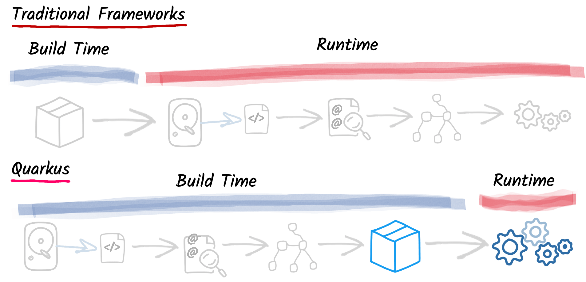
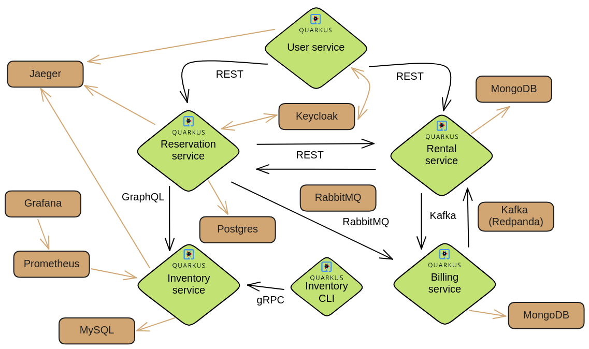

= The role of Quarkus in the modern Java ecosystem

From its inception in 2019, Quarkus gradually grows both in terms of its
user adoption and innovation. The number of its different research and
development areas is just enormous. It's one of the most active Java
projects you can find right now.

Last year, Quarkus celebrated its 5th birthday and one additional enormous
milestone -- 1000 contributors! Actually, there is already 59 more
contributors by now. And these are contributors of the main repository only,
not taking into account additional 170 repositories under the Quarkiverse
organization (which we tackle later in this article).

Quarkus pushes boundaries everywhere you can imagine. So, what does this say
about Quarkus's contribution to the Java ecosystem?

== Quarkus to the moon and beyond

Who could have imagined 6 years ago when a few very clever minds at Red Hat
came together and decided to design a new Java framework that it could
revolutionize the ways of Java development, that it would take off so fast.
Quarkus brought a new way of thinking to the engineering workflows -- a
framework that not only cares about the performance, but also puts excessive
emphasis on the developer experience.

For the purposes of this article, we can split the main features that
Quarkus provides that have an influence on its position in the Java
ecosystem into three categories:

- Performance characteristics
- Dev mode
- Community

Feel free to jump to relevant parts if you are already familiar with
Quarkus's basics. But we need to start from the beginning to provide the
full picture of where Quarkus stands today.

== What is Quarkus?

Java has come a long way since it was created 30 years ago. Originally
designed for long-running applications that didn't worry too much about fast
startup times or low memory utilization. But that changed when we started
moving our workloads to clouds. These exact metrics became a prominent
influence of our production costs.

Most of the Java ecosystem wasn't ready for this change which was one of the
main drivers to create Quarkus. Quarkus provides a very modern approach to
application development while it is still built on the shoulders of giants --
popular and years production-tested technologies like Hibernate, Netty, or
Vert.x. This is why it's popularity skyrocketed since it was announced. And
it is still continuously growing!

Quarkus is an JVM framework for enterprise application development. It
provides a platform for building microservices, serverless, or traditional
monolithic applications. Additionally, you can also use Quarkus to build
command line (CLI) applications, edge, GitHub bots, or Kubernetes operators.
And this is surely not exhaustive list.

Quarkus provides a very performant framework because it splits all
application processing into two phases - build time and runtime. Every
framework needs to execute various tasks when your application start:
loading and parsing of the configuration, classpath scanning (annotations),
analyzing dependencies, creating application model. Traditional frameworks
need to execute all these operations during when the application starts.
Every time it starts. So with every restart all of this processing needs to
be repeated, even if the application didn't change.

Quarkus moves as much of the framework processing to the build time -- to
when you compile and package your application. In this way, the results of
this processing are recorded and reused when the application starts. In
other words, they are computed during build time only once and reused in
runtime.

This variety of use cases is further
supported by seamless GraalVM (https://www.graalvm.org/) compilation for all
included Quarkus integrations (called extensions).

Extension encapsulate individual...

So what makes Quarkus so popular? In my opinion, two things: the technology
itself and the community. And Quarkus excels in both.

== Quarkus for developers

In my opinion, whether any tech is liked or not is always first and foremost
about the technology. Ask yourself what is more important to you when you
are choosing your framework? Is it performance? Or the tooling support?
Quarkus bet is that it is the overall development experience. And if you
think about, so many frameworks and even some programming languages have
been created solely to improve the development experience.

=== Squeezing every bit of performance from Java

=== Developer focused framework

While performance characteristics are surely important, they are mostly
relevant in production environments where we need to restrict utilized
resources. However, developers want a technology that helps them with the
application development. Technology that understands their needs and
provides simple way to solve their problems. And Quarkus invests heavily
into the developer experience (which pays back).

The single most important productivity tool in Quarkus is its Dev mode. Dev
mode is a continuous run of your Quarkus application in which Quarkus
embraced the concept of REPL (read-eval-print loop). By simply changing our
source code, Quarkus automatically recompiles and reruns our application,
showing the result of our work in mere milliseconds. But it doesn't stop
there. Quarkus's Dev mode encompasses many other functionalities that we
utilize in our everyday tasks. Features like continuous testing, Dev UI, or
Dev Services make development such an enthusiastic experience, that it's not
surprising people like to use Quarkus.

We don't really need to dive into the individual features too much, there
are a lot of relevant resources out there. But to give you an idea of
typical development workflow, I want to describe the car rental application
we develop in our latest Quarkus book called "Quarkus in Action" which was
released in January 2025 (there is a link to a free e-book at the end of
the article). The car rental application consists of five Quarkus services
that communicate together via various protocols and messaging technologies
including Apache Kafka, RabbitMQ, GraphQL, gRPC, and REST:

In the architecture diagram, the Quarkus services represent user developed
services and are marked with the Quarkus logo. The Inventory CLI is an
example command line application that manages the car rental fleet. You can
find the code at https://github.com/xstefank/quarkus-in-action. If we start
the remaining business services in Dev mode (they all run on different
ports), all remaining services start automatically as Dev Services.

Dev Services represent an abstraction of remote dependent services whether
it is a database (Postgres, MongoDB), messaging provider (Kafka, RabbitMQ),
or security (Keycloak). The Dev service is automatically started by the
Quarkus's Dev and test modes. So, you don't have to mix the provider
instances for development and test which is extremely useful in the
continuous testing we cover next. It essentially boils down to starting a
particular OCI (Docker or Podman) container for the particular provider
(utilizing Testcontainers), but it doesn't have to. Some Dev services (e.g.,
Derby or H2) start in-process.

You can disable most of the Dev services with configuration. Either with the
explicit disabling property or with an implicit definition of the
uniquely-defining instance of the provider. For instance, if you define the
connection URL to a database (`quarkus.datasource.jdbc.url`), Quarkus will
use your configured database and won't start a new container.

== Community engagement